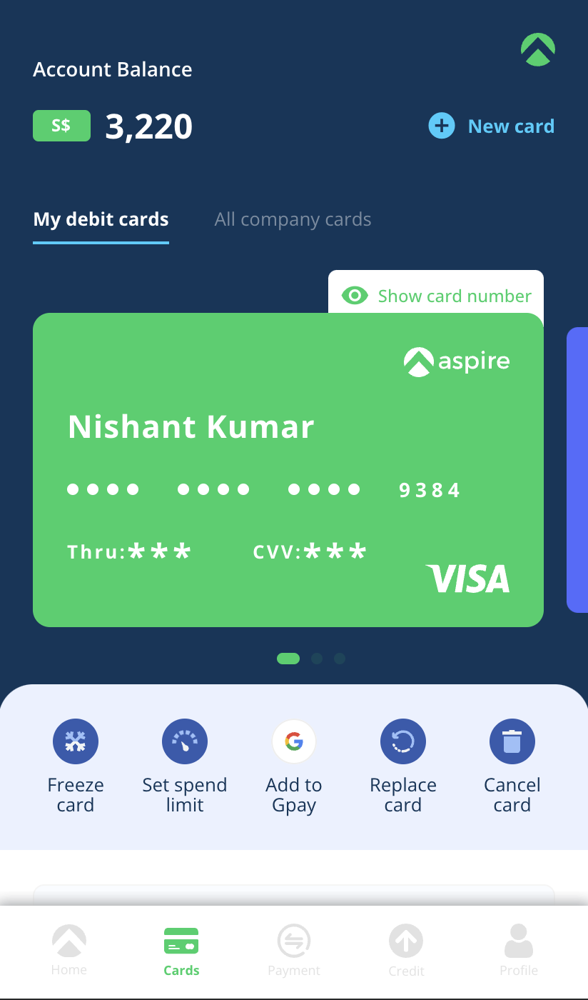
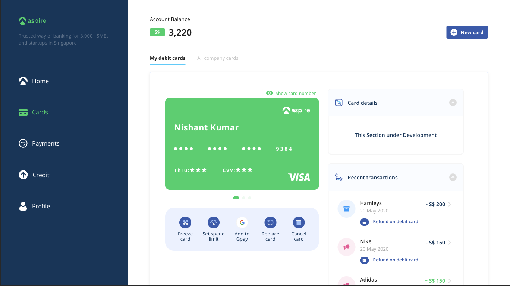

### Final result
Mobile layout
<div style="text-align:center"></div>

Desktop layout
<div style="text-align:center"></div>


## Frameworks used :

- Vue 3
- Qasar 2

## Project Structure :

- `**src**` : Contains the application's source code.
- **`components`**: Houses various components, like 'card', 'TransactionList', etc.
- **`pages`**: Hosts pages for the app, organized as follows:
    - **`mobile`**: For mobile page layouts.
    - **`desktop`**: For desktop page layouts.
- **`router`**: Manages the application's routing, linking pages to routes.
- **`services`**: Stores services for external communication, like APIs.
- **`svgs`**: A repository for all custom icons used in the app.
- **`stores`**: Contains store actions and getters.
- **`layouts`**: Defines the application's overall layout.
- **`css`**: Includes common CSS files for the app.
- **`assets`**: Stores static assets necessary for the application.

## How to run the application :

### Install the dependencies

```
yarn
# or
npm install
```

### Start the app in development mode (hot-code reloading, error reporting, etc.)

```
quasar dev
```

### Lint the files

```
yarn lint
# or
npm run lint
```

### Format the files

```
yarn format
# or
npm run format
```

### Build the app for production

```
quasar build
```

### Customize the configuration

See [Configuring quasar.config.js](https://v2.quasar.dev/quasar-cli-webpack/quasar-config-js).

## Where can I access it ?

The only working page right now is the cards page (Move to the cards tab to use the application)

[Aspire](https://lastbyte.github.io/aspire/#/cards)

## Functionalities

1. **`Add Card`**
Use the `add card` button to add a new card, on clicking the add card button a modal will show up, upon filling the form you can save the card.
    1. The form has following validations.
        1. all the fields are required
        2. card number should be 16 digits long
        3. cvv should be 3 digit long

2. **`Freeze/Unfreeze card`**
 Use the freeze/unfreeze button on the card control buttons present below the card.

3. **`Cancel Card`**
Use the cancel card button to remove or delete a card.
